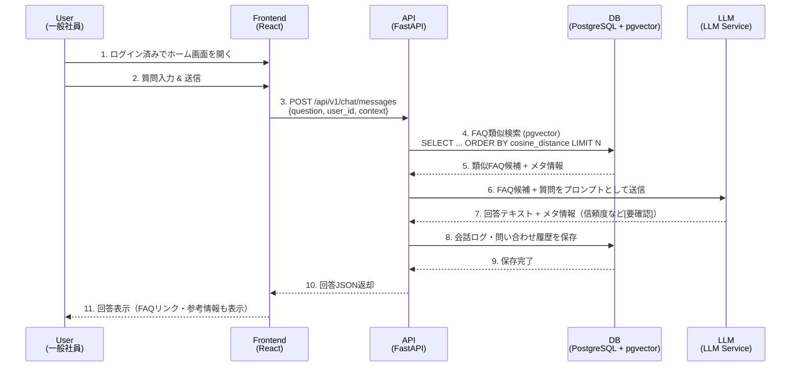
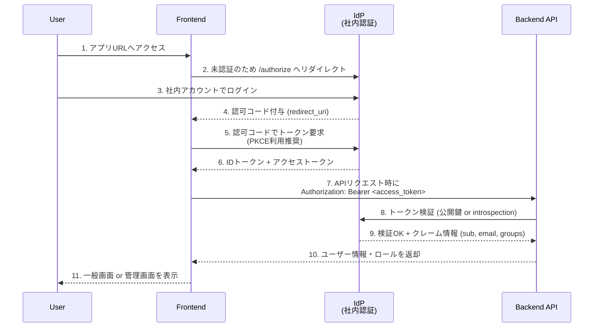
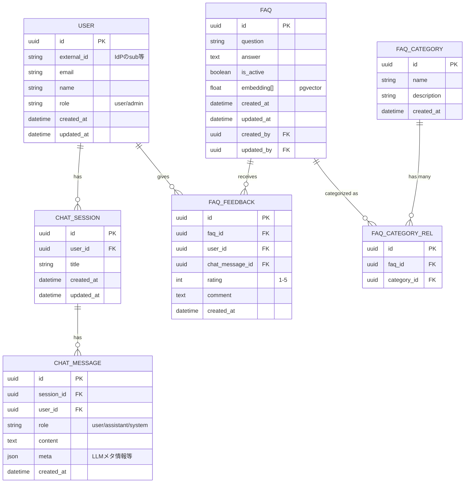

# Ai Web - Technical Design

## 1. Architecture

### 1.1 System Overview

社内ネットワーク内のみで利用される、AIコンシェルジュ（FAQ検索＋会話ログ管理）SaaSのMVPアーキテクチャ。

```mermaid
flowchart LR
    subgraph CorpNet[社内ネットワーク]
        User[一般社員 / 管理者<br/>Webブラウザ] --> FE[フロントエンド SPA<br/>(React / TypeScript)]

        FE --> API[Backend API<br/>(FastAPI / Python)]
        API --> DB[(RDB: PostgreSQL)]
        API --> VStore[(ベクトルDB<br/>FAQ埋め込み)]
        API --> LogStore[(会話ログ / 監査ログ)]

        subgraph Auth[社内認証基盤]
            IDP[IdP (SSO / SAML / OIDC)]
        end

        FE --> IDP
        API --> IDP
    end

    subgraph Ext[社外サービス ※必要に応じて]
        LLM[LLM API<br/>(社内 or クラウド)]
    end

    API --> LLM

```

- 社内ネットワーク内にフロントエンド・API・DBを配置
- 認証は既存の社内IdPと連携（SSO）
- FAQ検索は RDB＋ベクトルDB（類似検索）を利用
- LLMは社内設置モデル or クラウドAPI（[要確認]）を利用

### 1.2 Component Architecture

| Component | Responsibility | Technology |
|-----------|----------------|------------|
| Web Frontend | チャットUI、FAQ検索画面、問い合わせ履歴表示、管理画面（FAQ CRUD・ログ閲覧） | React / TypeScript / Vite or Next.js (SPA/SSRは[要確認]) |
| Backend API | REST/GraphQL API提供、認証・認可、FAQ管理、問い合わせ履歴管理、LLM連携、FAQ検索ロジック | Python / FastAPI |
| Auth Integration | 社内IdPとのSSO連携、アクセストークン検証、ロール判定（一般社員/管理者） | OIDC or SAML 2.0（IdP種別は[要確認]） |
| RDB | ユーザー、FAQ、カテゴリ、会話ログ、問い合わせ履歴、管理用メタデータの永続化 | PostgreSQL |
| Vector Store | FAQコンテンツの埋め込み保存、類似検索（セマンティック検索） | pgvector on PostgreSQL or 専用ベクトルDB（Qdrant / Milvus）[要確認] |
| LLM Service | 自然言語回答生成、FAQ要約、カテゴリ自動分類 | 社内LLM or クラウドLLM（Azure OpenAI, OpenAI API 等）[要確認] |
| Admin Console | FAQ登録・編集、会話ログ閲覧、モデル回答のレビュー・改善 | フロントエンド内の管理画面（RBACで制御） |
| Logging / Monitoring | アプリログ、監査ログ、メトリクス収集 | 社内標準（例: ELK, Prometheus + Grafana）[要確認] |

### 1.3 Technology Stack

- **Language**:
  - Backend: Python 3.11+
  - Frontend: TypeScript 5+
- **Framework**:
  - Backend: FastAPI
  - Frontend: React + Vite（もしくは Next.js [要確認]）
- **Database**:
  - PostgreSQL 14+（pgvector拡張を利用）
- **Infrastructure**:
  - コンテナ: Docker
  - オーケストレーション: 社内Kubernetes or VMベース（[要確認]）
  - リバースプロキシ / API Gateway: Nginx or 社内標準GW
  - 認証基盤: 社内IdP（Azure AD / Keycloak / 他 [要確認]）
- **External Services**:
  - LLM API: Azure OpenAI / OpenAI / 社内LLM（[要確認]）
  - メール通知など: 社内SMTP（必要なら）

---

## 2. Data Flow

### 2.1 Main Flow

一般社員がAIコンシェルジュを利用して質問し、回答を得るまでのメインフロー。



### 2.2 Authentication Flow

社内IdPとのSSOを前提とした認証フロー（OIDC想定）。



---

## 3. Interfaces

### 3.1 API Endpoints

MVPで想定される主なREST API（パスは例）。

| Method | Endpoint | Description |
|--------|----------|-------------|
| POST | /api/v1/auth/token | SPAからのトークン交換（必要な場合）[要確認] |
| GET | /api/v1/me | ログインユーザー情報取得（ロール含む） |
| GET | /api/v1/faq | FAQ一覧取得（検索クエリ・カテゴリフィルタ対応） |
| GET | /api/v1/faq/{id} | FAQ詳細取得 |
| POST | /api/v1/faq | FAQ新規登録（管理者のみ） |
| PUT | /api/v1/faq/{id} | FAQ更新（管理者のみ） |
| DELETE | /api/v1/faq/{id} | FAQ削除 or 非表示化（管理者のみ） |
| GET | /api/v1/faq/categories | FAQカテゴリ一覧取得 |
| POST | /api/v1/chat/messages | 質問送信＋AI回答生成（会話ログ保存） |
| GET | /api/v1/chat/sessions | 自分の会話セッション一覧取得 |
| GET | /api/v1/chat/sessions/{session_id} | セッション内メッセージ履歴取得 |
| GET | /api/v1/admin/logs/conversations | 全ユーザーの会話ログ一覧（管理者のみ） |
| GET | /api/v1/admin/logs/conversations/{id} | 会話詳細（管理者のみ） |
| POST | /api/v1/admin/feedback | 管理者による回答評価・修正登録 |
| GET | /api/v1/health | ヘルスチェック |

※ 回答精度の自動改善・カテゴリ自動分類は、MVPではバッチ or 非同期ジョブとして設計し、APIは後続で追加する想定。

### 3.2 External Integrations

| Service | Purpose | Authentication |
|---------|---------|----------------|
| 社内IdP (OIDC/SAML) | シングルサインオン、ユーザー属性取得、ロール判定 | OIDC: Authorization Code + PKCE / SAML: SSO POST Binding |
| LLM API (Azure OpenAI / OpenAI / 社内LLM) | 自然言語回答生成、FAQ要約、カテゴリ自動分類 | API Key / AADトークン / 社内認証 [要確認] |
| ログ基盤（例: ELK）[要確認] | アプリケーションログ・監査ログの集中管理 | 社内標準のログ転送方式（Filebeat, Fluentd等） |

---

## 4. Data Models

### 4.1 Entity Relationship



### 4.2 Core Entities

#### Entity: User

```json
{
  "id": "uuid",
  "external_id": "string", 
  "email": "string",
  "name": "string",
  "role": "user | admin",
  "created_at": "datetime",
  "updated_at": "datetime"
}
```

#### Entity: FAQ

```json
{
  "id": "uuid",
  "question": "string",
  "answer": "string",
  "is_active": true,
  "categories": ["string"],
  "embedding": [0.123, -0.456],
  "created_by": "uuid",
  "updated_by": "uuid",
  "created_at": "datetime",
  "updated_at": "datetime"
}
```

#### Entity: ChatSession

```json
{
  "id": "uuid",
  "user_id": "uuid",
  "title": "string",
  "created_at": "datetime",
  "updated_at": "datetime"
}
```

#### Entity: ChatMessage

```json
{
  "id": "uuid",
  "session_id": "uuid",
  "user_id": "uuid",
  "role": "user | assistant | system",
  "content": "string",
  "meta": {
    "faq_candidates": [
      { "faq_id": "uuid", "score": 0.87 }
    ],
    "llm_model": "string",
    "latency_ms": 850
  },
  "created_at": "datetime"
}
```

#### Entity: FAQFeedback

```json
{
  "id": "uuid",
  "faq_id": "uuid",
  "user_id": "uuid",
  "chat_message_id": "uuid",
  "rating": 4,
  "comment": "string",
  "created_at": "datetime"
}
```

---

## 5. Error Handling

### 5.1 Error Codes

| Code | Description | Recovery |
|------|-------------|----------|
| E001 | 認証エラー（トークン無効・期限切れ） | 再ログインを促す。フロントでIdPへリダイレクト。 |
| E002 | 権限エラー（管理者権限なし） | 「権限がありません」と表示し、一般画面へ戻す。 |
| E003 | 入力バリデーションエラー | エラー項目をフィールド単位で表示し、再入力を促す。 |
| E004 | FAQが見つからない | 「該当するFAQがありません」と表示し、再検索を促す。 |
| E005 | LLMサービスエラー / タイムアウト | 「現在AI回答が利用できません」と表示し、FAQ検索結果のみを返す。リトライ可能。 |
| E006 | データベースエラー | 一般的なエラーメッセージを表示し、再試行を案内。ログに詳細を記録。 |
| E007 | レートリミット超過 | 「短時間に多数のリクエストが行われました」と表示し、一定時間後の再試行を促す。 |

### 5.2 Error Response Format

```json
{
  "error": {
    "code": "E001",
    "message": "認証に失敗しました。再度ログインしてください。",
    "details": {
      "field_errors": {
        "question": ["質問は必須です。"]
      },
      "trace_id": "uuid"
    }
  }
}
```

---

## 6. Security Considerations

- **Authentication:**
  - 社内IdPとのSSO（OIDC Authorization Code + PKCE を推奨）
  - APIはBearerトークンで認証
- **Authorization:**
  - ロールベースアクセス制御（RBAC）
    - `user`: チャット利用、自己の履歴閲覧
    - `admin`: FAQ CRUD、全会話ログ閲覧
  - エンドポイント単位でロールチェック（FastAPIの依存性注入で実装）
- **Data Encryption:**
  - 通信: HTTPS（社内でもTLS終端を必須）
  - 保存: DBレベルの暗号化（ディスク暗号化）[要確認]
  - 機微情報（個人情報を含むログなど）はカラム単位暗号化を検討 [要確認]
- **Input Validation:**
  - Backendで全入力をスキーマ（Pydantic）で検証
  - XSS対策: 出力時のエスケープ、Markdownレンダリング時のサニタイズ
  - SQL Injection対策: ORM（SQLAlchemy）利用、プレースホルダ必須
- **その他:**
  - LLMへのプロンプトに個人情報を含めないポリシー（またはマスキング）を検討
  - 管理画面へのアクセスはIP制限 or VPN内限定
  - 監査ログ（誰がどのFAQを編集したか、どのログを閲覧したか）を記録

---

## 7. Unit Testing Strategy

### 7.1 Test Categories

| Category | Coverage Target | Tools |
|----------|-----------------|-------|
| Unit Tests | 80%+ (ドメインロジック・検索ロジック・認可) | pytest (Backend), Jest / Vitest (Frontend) |
| Integration Tests | 主要API（チャット、FAQ CRUD、認証連携） | pytest + Test DB (PostgreSQL) |
| E2E Tests | 代表的なユーザーストーリー（質問〜回答、FAQ編集） | Playwright / Cypress |
| Load Tests | チャットAPIのレスポンス2秒以内確認 | k6 / Locust [要確認] |

### 7.2 Test Structure

```text
backend/
  app/
  tests/
    unit/
      test_faq_service.py
      test_auth.py
      test_chat_flow.py
    integration/
      test_api_faq.py
      test_api_chat.py
      test_auth_integration.py
    e2e/
      (APIレベルのシナリオテスト)

frontend/
  src/
  tests/
    unit/
      components/
      hooks/
    e2e/
      (Playwright/Cypressシナリオ)
```

---

## 8. Implementation Notes

### 8.1 Key Decisions

| Decision | Choice | Rationale |
|----------|--------|-----------|
| アーキテクチャスタイル | SPA + REST API | 社内利用であり、シンプルな構成でMVPを素早く実装するため。 |
| Backendフレームワーク | FastAPI | 型安全・高速・OpenAPI自動生成が可能で、AI連携などの非同期処理に適しているため。 |
| DB | PostgreSQL + pgvector | FAQ検索にベクトル検索を利用しつつ、トランザクション性も確保できるため。 |
| 認証方式 | 社内IdPとのSSO (OIDC想定) | 既存の社内アカウントを利用し、セキュリティと運用負荷を最小化するため。 |
| LLM連携 | 外部API or 社内LLMを抽象化したService層でラップ | 将来のモデル切替（社外→社内LLM）を容易にするため。 |
| ログ保存範囲 | 全会話ログを保存 | 回答精度改善・監査のため。ただし保持期間・匿名化ポリシーは別途定義 [要確認]。 |
| レスポンス要件 | 2秒以内 | LLM呼び出しを含むため、FAQのみの回答フォールバックを用意しUXを担保。 |

### 8.2 Known Limitations

- LLMの品質・社内FAQの整備状況に依存するため、初期段階では誤回答リスクが残る。
- 社外LLMを利用する場合、プロンプト内の情報が外部に送信されるため、扱える情報に制限が必要。
- 回答精度の自動改善・カテゴリ自動分類はMVPでは簡易実装（ログ分析＋手動チューニング中心）となる可能性が高い。
- モバイル対応はレスポンシブWebで行うが、ネイティブアプリは対象外。

### 8.3 Future Considerations

- 回答精度自動改善:
  - フィードバックデータを用いたFAQランキング調整
  - LLMファインチューニング or RAGパイプライン高度化
- カテゴリ自動分類:
  - LLM or 軽量分類モデルでの自動タグ付け
  - 管理画面での一括修正UI
- 多言語対応:
  - 日本語以外の問い合わせへの対応（翻訳API連携など）
- 通知機能:
  - 回答が遅延する問い合わせに対するメール/チャット通知
- SLA/運用:
  - 稼働監視、アラート設計、障害対応手順の整備
- 権限の細分化:
  - FAQ編集権限を部門単位に分割（人事FAQ、総務FAQなど）

---

[要確認] タグの項目（インフラ種別、IdP種別、LLM種別、ログ基盤、暗号化ポリシー等）は、インフラ/セキュリティ担当との合意後に確定し、本ドキュメントを更新する。